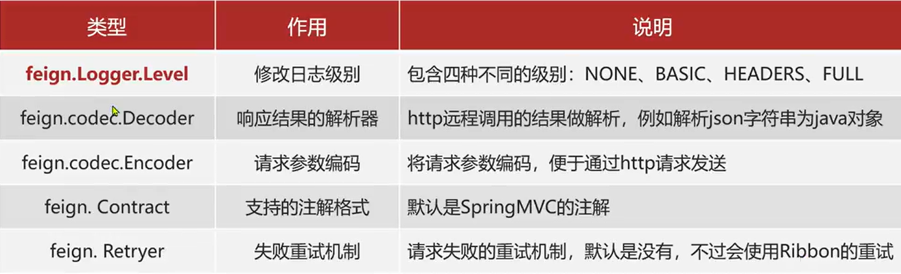

### Feign 远程调用

**步骤**:
导入依赖

```xml
        <!--        feign远程调用-->
<dependency>
    <groupId>org.springframework.cloud</groupId>
    <artifactId>spring-cloud-starter-openfeign</artifactId>
    <version>2.2.5.RELEASE</version>
</dependency>
```

开启自动装配

```java

@SpringBootApplication
@EnableFeignClients
public class ConsumerServiceApplication {
    public static void main(String[] args) {
        SpringApplication.run(ConsumerServiceApplication.class, args);
    }
}
```

编写客户端做接口声明

```java

@FeignClient("producer-service")
public interface ProducerService {
    @GetMapping("/hello")
    String hello();
}
```

调用测试

```java
@Resource
private ProducerService producerService;

@GetMapping("/api/hello")
public String getData(){
        String hello=producerService.hello();
        return"test:=>"+hello;
}
```

### 自定义配置
以下常用的配置项：

一般情况下，都不需要做过多的修改，顶多修改一下日志级别。

**配置日志级别案例：**

方式一：代码中配置
```java
// 局部生效
@FeignClient(name = "example", url = "http://localhost:8080", configuration = MyFeignConfiguration.class)
public interface MyFeignClient {
    // Feign client methods
}

// 全局生效，在配置类中加上，@EnableFeignClients(defaultConfiguration = MyFeignConfiguration.class)

```
```java
@Configuration
public class MyFeignConfiguration {
    @Bean
    Logger.Level feignLoggerLevel() {
        return Logger.Level.FULL;
    }
}
```

方式二：配置文件中配置
```yaml
feign:
  client:
    config: 
      default: # 默认是全局生效，如果default修改成服务名，就针对服务名生效
        loggerLevel: FULL  # 日志级别
```

### Feign使用优化

**底层的客户端实现**：
- URLConnection：默认实现，不支持连接池
- Apache HttpClient：支持连接池
- OKHttp：支持连接池

固性能优化可以切入的点有：
1. 使用连接池代替默认的URLConnection
2. 日志级别，最好使用Basic或者none


**更换**：
```xml
        <!--        httpClient-->
        <dependency>
            <groupId>io.github.openfeign</groupId>
            <artifactId>feign-httpclient</artifactId>
            <version>12.2</version>
        </dependency>
```
```yaml
feign:
  client:
    config:
      default: # 默认是全局生效，如果default修改成服务名，就针对服务名生效
        loggerLevel: BASIC  # 日志级别
  httpclient:
    enabled: true # 开启feign对HttpClient的支持
    max-connections: 200 # 最大的连接数
    max-connections-per-route: 50 # 每个路径的最大连接数
```

### 最佳方案

**方案一(继承)**：给消费者的FeignClient和提供者的controller定义一个统一的父接口作为标准。
- 方式：controller和FeignClient继承同一个接口。
- 特点 紧耦合，父接口列表中的映射不会被继承，但是遵循了契约规范。

**方案二（抽取)**: 将FeignClient抽取为独立模块，并且把接口有关的Pojo，默认的Feign配置都放在这个模块中，提供给所有的消费者。
- 将FeignClient，pojo，feign的默认配置都定义到一个项目中，供所有消费者使用。
- 特点：解耦合，但是：单模块导入，可能会导入大量不需要的依赖。


**方式二步骤**：
1. 新建feign-api模块，导入feign依赖
```xml
        <!--        feign远程调用-->
        <dependency>
            <groupId>org.springframework.cloud</groupId>
            <artifactId>spring-cloud-starter-openfeign</artifactId>
            <version>2.2.5.RELEASE</version>
        </dependency>
```
2. 定义调用客户端
```java

@FeignClient("producer-service")
public interface ProducerService {
    @GetMapping("/api/hello")
    String hello();
}
```
3. 扫描客户端所在位置
```java
@SpringBootApplication
//@EnableFeignClients(basePackages = {"com.axcmsm"}) //方式一：指定包扫描
@EnableFeignClients(clients = {ProducerService.class}) //方式二：指定加载客户端
public class ConsumerServiceApplication {
    public static void main(String[] args) {
        SpringApplication.run(ConsumerServiceApplication.class, args);
    }
}
```