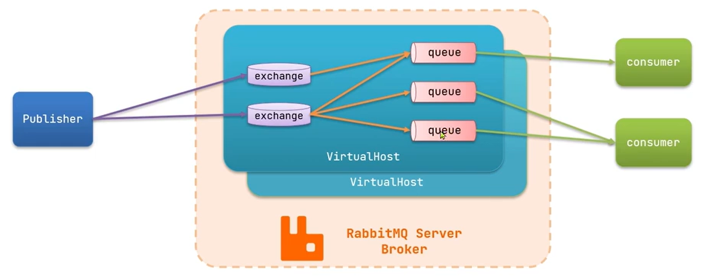

### 异步通信-MQ

同步通信

- 优点：时效性强，可以立即得到结果
- 缺点：耦合度高 性能吞吐下降 浪费资源 级联失败

异步通信

- 常见模式：事件驱动模式
- 优点：服务解耦，吞吐量提升，故障隔离，流量消峰
- 缺点：
    - 依赖Broker的可靠性，安全性，吞吐能力
    - 架构复杂，业务没有明显流程线，不好追踪管理

**MQ常见框架**:


**使用情况**：

- RabbitMQ(小型企业，社区活跃)
- RocketMQ(大型企业，自定义需求)
- kafka(大数据传输)

> 这里主要讲述了Rabbit的实现方案.
---

### 安装部署

**单机部署**（docker）

1. 下载镜像：

```shell
docker pull rabbitmq:3-management

# 命令解释：
# rabbitmq:3-management 是带有 Web 管理界面的 RabbitMQ 镜像。
```

2. 启动 RabbitMQ 容器

```shell
docker run -d --name rabbitmq -p 15672:15672 -p 5672:5672 rabbitmq:3-management

# 参数描述：
# --name rabbitmq 指定容器名称为 rabbitmq，
# -p 15672:15672 指定将 RabbitMQ Web 管理界面映射到宿主机的 15672 端口，
# -p 5672:5672 指定将 RabbitMQ 服务的 AMQP 端口映射到宿主机的 5672 端口。
# 可选（配置密码）
# -e PABBITMQ_DEFAULT_USER=axcmsm 
# -e PABBITMQ_DEFAULT_PASS=123456 

```

3. 访问 RabbitMQ Web 管理界面：
    - 在浏览器中访问 <http://localhost:15672>，
    - 输入默认的用户名和密码 guest/guest 即可进入 RabbitMQ Web 管理界面。

> 可以通过docker search 查询docker最新的镜像进行下载安装。


**基本概念**：


- channel: 操作MQ的工具
- exchange：路由消息到队列中
- queue：缓存消息
- virtual host：虚拟主机，是对queue，exchange等资源的逻辑分组

### 快速入门

**入门案例**:<https://www.rabbitmq.com/getstarted.html>

- 基本消息队列（BasicQueue)
- 工作消息队列（WorkQueue)
- 发布定义（Publish,Subscribe),又根据交换机类型不同分为三种。
    - Fanout Exchange:广播
    - Direct Exchange:路由
    - Topic Exchange:主题

**SpringAMQP**: 高级消息队列协议

**具体实现**：基本队列案例，一对一

1. 导入依赖

```xml

<dependency>
    <groupId>org.springframework.boot</groupId>
    <artifactId>spring-boot-starter-amqp</artifactId>
</dependency>
```

2. 配置链接信息

```properties
spring.rabbitmq.host=localhost
spring.rabbitmq.port=5672
spring.rabbitmq.username=guest
spring.rabbitmq.password=guest
spring.rabbitmq.virtual-host=/
```

3. 监听消息

```java

@Component
public class Consumer {
    @RabbitListener(queues = "simple.hello")
    public void receive(String message) {
        System.out.println(" [x] Received '" + message + "'");
    }
}

```

4. 发送消息

```java

@SpringBootTest
class ProducerServiceApplicationTests {
    @Autowired
    private RabbitTemplate rabbitTemplate;

    /**
     * 发送消息:普通消息队列
     */
    @Test
    void testSendToRabbitMQSimpleQueue() {
        String queueName = "simple.hello";//需要新建队列
        String message = "hello, spring ampq!1";
        rabbitTemplate.convertAndSend(queueName, message);
    }
}
```

**工作队列**：

- 提高消费信息处理速度，避免队列消息堆积。
- 一个队列绑定多个消费者。

> 消息预取，默认是无上限平均分配，可用在配文件中配置
> ```properties
> # 每次只能获取一条消息，处理完成才能获取下一个消息
> spring.rabbitmq.listener.simple.prefetch=1
>```

**发布和订阅**：允许同一个消息发送给多个消费者。加入了 exchange(交换机)

exchange的常见类型：
- fanout：广播
- direct：路由
- topic：主题
> exchange 负责消息路由，而不是存储，路由失败则消息丢失


### **Fanout广播**:交换机

```java
@Configuration
public class FanoutConfig {
    /**
     * 声明 FanoutExchange 交换机
     *
     * @return
     */
    @Bean
    public FanoutExchange fanoutExchange() {
        return new FanoutExchange("axcmsm.fanout");
    }

    @Bean
    public Queue fanoutQueue1() {
        return new Queue("fanout.queue1");
    }

    @Bean
    public Queue fanoutQueue2() {
        return new Queue("fanout.queue2");
    }

    /**
     * 绑定队列1和交换机
     * @param fanoutQueue1
     * @param fanoutExchange
     * @return
     */
    @Bean
    public Binding bindingQueue1(Queue fanoutQueue1,FanoutExchange fanoutExchange){
        return BindingBuilder.bind(fanoutQueue1).to(fanoutExchange);
    }
    @Bean
    public Binding bindingQueue2(Queue fanoutQueue2,FanoutExchange fanoutExchange){
        return BindingBuilder.bind(fanoutQueue2).to(fanoutExchange);
    }
}

```
```java
/**
 * 接收消息
 */
@Component
public class Consumer {
    @RabbitListener(queues = "fanout.queue1")
    public void fanoutQueue1(String message) {
        System.out.println("fanoutQueue1:=>" + message );
    }
    @RabbitListener(queues = "fanout.queue2")
    public void fanoutQueue2(String message) {
        System.out.println("fanoutQueue2:=>"+message);
    }
}
```
```java
    @Test
    void testSendToRabbitMQSimpleFanoutExchange(){
        String exchangeName="axcmsm.fanout";//交换机
        String message="你好世界！"; //消息
        rabbitTemplate.convertAndSend(exchangeName,"",message);
    }
```

### **direct (路由)**：（交换机）

这里使用注解的方式，可用使用bean的方式。
```java
@Component
public class Consumer {
    @RabbitListener(bindings = @QueueBinding(
            value = @Queue(name = "direct.queue1"),
            exchange = @Exchange(name = "axcmsm.direct",type = ExchangeTypes.DIRECT),
            key = {"red","blue"}
    ))
    public void listenDirectQueue1(String msg){
        System.out.println("消费者接收到direct.queue1的消息：【"+msg+"】");
    }

    @RabbitListener(bindings = @QueueBinding(
            value = @Queue(name = "direct.queue2"),
            exchange = @Exchange(name = "axcmsm.direct",type = ExchangeTypes.DIRECT),
            key = {"red","yellow"}
    ))
    public void listenDirectQueue2(String msg){
        System.out.println("消费者接收到direct.queue2的消息：【"+msg+"】");
    }
}
```
```java
    @Test
    void testSendToRabbitMQSimpleDirectExchange(){
        String exchangeName="axcmsm.direct";//交换机
        String message="你好 red ！"; //消息 发给 red yellow
        rabbitTemplate.convertAndSend(exchangeName,"red",message);
    }
```

### **TopicExchange**:

topicExchange 和 Direct类似，主要区别在于，topic 的 rountingKey必须由多个单词组成，并且以.分割

queue与exchange指定bindingkey时，可以使用通配符：
- `#`: 代表0个或多个
- `*`：代表一个单词

例如：
- axcmsm.new  => axcmsm.#
- axcmsm.weather => #.weather

```java
    @RabbitListener(
            bindings = @QueueBinding(
                    value = @Queue(name = "topic.queue1"),
                    exchange = @Exchange(name = "axcmsm.topic",type = ExchangeTypes.TOPIC),
                    key = "axcmsm.#"
            )
    )
    public void listenTopicQueue1(String msg){
        System.out.println("消费者接收到topic.queue1的消息：【"+msg+"】");
    }

    @RabbitListener(
            bindings = @QueueBinding(
                    value = @Queue(name = "topic.queue2"),
                    exchange = @Exchange(name = "axcmsm.topic",type = ExchangeTypes.TOPIC),
                    key = "#.weather"
            )
    )
    public void listenTopicQueue2(String msg){
        System.out.println("消费者接收到topic.queue2的消息：【"+msg+"】");
    }
```
```java
    @Test
    void testSendToRabbitMQSimpleTopicExchange(){
        String exchangeName="axcmsm.topic";//交换机
        String message="你好 new axcmsm ！"; //消息 发给 axcmsm.new (一个收到)和 axcmsm.weather(2个收到）
        rabbitTemplate.convertAndSend(exchangeName,"axcmsm.new",message);
    }
```


### 消息转换器
> Spring对消息对象的处理是由 org.springframework.amqp.support.converter.MessageConverter 来处理的。 而默认的实现为 SimpleMessageConverter。 
> 是基于JDK的ObjectOutputStream完成序列化，如果需要修改序列化，
> 我们需要定义一个 MessageConverter 的类型Bean即可，推荐使用Json序列化。

**案例**：
```xml
        <!--        json序列化-->
        <dependency>
            <groupId>com.fasterxml.jackson.dataformat</groupId>
            <artifactId>jackson-dataformat-xml</artifactId>
        </dependency>
```
```java
@SpringBootApplication
public class ProducerServiceApplication {
    public static void main(String[] args) {
        SpringApplication.run(ProducerServiceApplication.class, args);
    }
    @Bean
    public MessageConverter jsonMessageConverter(){
        return new Jackson2JsonMessageConverter();
    }
}
```
