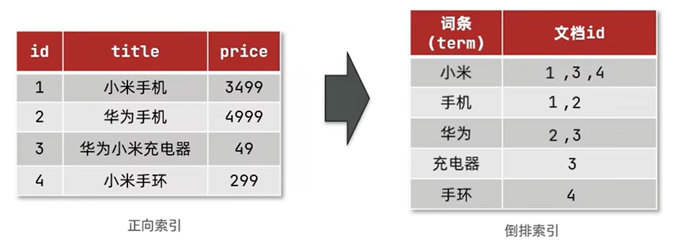
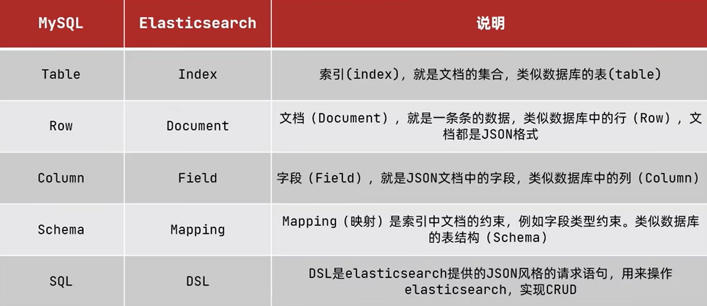
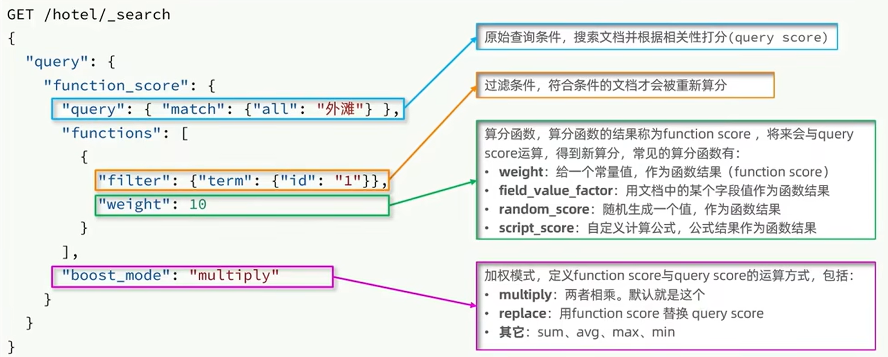

### 分布式搜索 Elasticsearch

开源的分布式搜索引擎，用来实现，日志统计，分析，系统监控等功能。

ELK: Elasticsearch + Beats + Kibana + kibana 等技术栈

Lucene：是Apache开源的搜索引擎类库，提供了搜索引擎的核心API

倒排索引：

- 文档(document)：每条数据就是一个文档
- 词条（term）：文档按照语义分层的词语
  

搜索 => 分词 => 根据词条查找文档id => 根据文档id查找文档 => 存入结果集
> 虽然是经历了俩次查询，但都是根据索引进行查询的，效率相对与逐行查询是要快上不少的。

**Es与Mysql对比**:


- Mysql：擅长事务类型操作，可以确保数据的安全和一致性
- ES：擅长海量数据的搜索，分析，计算

---

### 部署

**docker(单节点)**：

```shell
# 创建es网络
docker network create es-net
```

**安装ES**:

1. 拉取Elasticsearch镜像：在命令行中输入以下命令来下载Elasticsearch的最新版本镜像：

```shell
docker pull elasticsearch:7.12.0

```

2. 创建并启动Elasticsearch容器：使用下面的命令创建并启动一个名为“es”的容器：

```shell
docker run -d --name es --network es-net   -p 9200:9200 -p 9300:9300 -e "discovery.type=single-node" elasticsearch:7.12.0

#-d 参数使容器在后台运行。
#--name 参数指定容器的名称。
#-p 参数将容器的 9200 和 9300 端口映射到主机的对应端口。
#-e 参数设置Elasticsearch的配置选项。
#-v 将数据目录和插件目录挂载到外面（可选）
#--network es-net  # docker network create es-net
# --privileged 参数表示在容器内开启特权模式，即给予容器中的进程超级权限，使其能够使用主机的所有设备和系统功能。这样做的目的是为了便于在容器中执行需要特殊权限的任务，例如设备管理和调试等。但是，使用该参数也可能会暴露主机系统的安全风险。
#elasticsearch:7.12.0 是先前下载的Elasticsearch镜像。
# -v es-data:/usr/share/elasticsearch/data -v es-plugins:/usr/share/elasticsearch/plugins
```

3. 测试：等待Elasticsearch启动成功后，在浏览器中输入 <http://your_server_ip:9200>

**kibana**:

1. 打开终端并输入以下命令，拉取Kibana 7.12.0 版本镜像。

```shell
docker pull kibana:7.12.0
```

2. 创建一个Kibana容器：

```shell
#docker run --name kibana --link my-es-container:elasticsearch -p 5601:5601 -d kibana:7.12.0
docker run --name kibana --network=es-net -e ELASTICSEARCH_HOSTS=http://es:9200 -p 5601:5601 -d kibana:7.12.0
# --name 参数指定容器的名称为“kibana”。
# --link 参数将Kibana容器与先前创建的Elasticsearch容器连接在一起，使它们可以相互通信。my-es-container 是先前创建的Elasticsearch容器的名称。
# -p 参数将容器的 5601 端口映射到主机的对应端口。
# -d 参数使容器在后台运行。
# kibana:7.12.0 是先前下载的Kibana镜像。
```

3. 在浏览器中使用 <http://your_server_ip:5601> 访问 Kibana 页面。欢迎页面，安装成功。
4. 检查Kibana是否正常连接到 Elasticsearch：
    1. 在 Kibana 首页单击左侧导航栏中的 "Management"，
    2. 然后单击 "Kibana" > "Index Patterns"。
    3. 输入 "logstash-*" 作为 index pattern 名称，单击 "Create" 按钮。
    4. 如果能看到成功创建索引模式的提示，则表明Kibana已经成功连接到Elasticsearch。

> 在这个过程中，我们使用 --link my-es-container:elasticsearch 命令将 Elasticsearch 容器链接到 Kibana 容器中，其中 elasticsearch 是 Elasticsearch 的默认主机名称。请确保Kibana中的 elasticsearch.hosts 参数与此名称匹配，以便Kibana正确连接到 Elasticsearch。


**安装 IK 分词器的步骤**:

1. 打开终端并进入 Elasticsearch 容器：

```shell
docker exec -it es /bin/bash
```

2. 确认当前目录位置是 Elasticsearch 配置目录 /usr/share/elasticsearch/。
3. 下载 IK 分词器插件：

```shell
./bin/elasticsearch-plugin install https://github.com/medcl/elasticsearch-analysis-ik/releases/download/v7.12.0/elasticsearch-analysis-ik-7.12.0.zip
```

4. 插件下载完成后，重启 Elasticsearch 容器以使其生效。
```shell
docker restart es
```
5. 检测插件是否成功安装，可以通过以下方式之一来测试： 
   - 方式一：运行以下命令，确保 ik 分词器在已经安装的分析器中列出。
   ```shell
   curl -X GET "localhost:9200/_analyze?pretty" -H 'Content-Type: application/json' -d'
   {
   "analyzer": "ik_max_word",
   "text": "你好，我是须贺！"
   }
   '
   ```
   - 方式二：打开 Kibana，创建一个索引模式，选择 "IK" 分词器作为默认分词器。随后您将能够使用 "IK" 分词器进行搜索和聚合操作。

**添加自定义扩展分词**：
```shell
docker exec -it es /bin/bash

cd /usr/share/elasticsearch/config/analysis-ik

vi IKAnalyzer.cfg.xml 

#修改 IKAnalyzer.cfg.xml 文件，以使其能够加载新的扩展词库。
# 在 <properties> 标签中添加以下配置：
# 配置自己的扩展词汇
<entry key="ext_dict">ext.dic</entry> 
# 排除敏感词汇
<entry key="ext_stopwords">stopword.dic</entry> 

# 注意，ext.dic和stopword.dic 是当前目录下的文件，需要新建，然添加即可
[root@f13848de9eca analysis-ik]# cat ext.dic 
须贺
你好
axcmsm

#在 Elasticsearch 容器中重新启动服务，使更改生效。
docker restart es

# 测试：
POST /_analyze
{
  "analyzer": "ik_max_word",
  "text": "你好，我是须贺！"
}


```


**IK分词器模式**：
- `ik_smart`：智能切分，粗粒度
- `ik_max_word`：最细切分，细粒度

作用：
- 创建刀片索引时对文档进行分词
- 用户搜索时，对输入的内容分词


---

### DSL操作案例

### 索引库操作

**mapping属性(常见)**：
- type: 字段类型，常见 的类型有：
  - 字符串：text(可分词文本)，keyword(精确值，例如：品牌，国家，ip地址)
  - 数值：long，integer,short,byte,double,float
  - 布尔值：boolean
  - 日期：date
  - 对象：object
- index：是否创建索引，默认为true （拆分）
- analyzer：使用那种分词器
- properties: 该字段的子字段

**创建索引库案例**：
```shell
PUT /axcmsm_test
{
  "mappings": {
    "properties": {
      "info":{
        "type": "text",
        "analyzer": "ik_smart"
      },
      "email":{
        "type": "keyword",
        "index": false 
      },
      "name":{
        "type": "object", 
        "properties": {
          "firstName":{
            "type":"keyword",
            "index":false
          },
          "lastName":{
            "type":"keyword"
          }
        }
      }
    }
  }
}
```
**查询or删除索引库**:
```shell
# 查询索引库
GET /axcmsm_test

# 删除索引库
DELETE /axcmsm_test
```

**修改索引库**:
> 禁止修改，支持添加，因为已经对某些分词创建了倒排索引库了，如果修改是非常消耗性能的，不推荐修改，但可以添加。
```shell
PUT /axcmsm_test/_mapping
{
  "properties":{
      "age":{
        "type": "integer",
        "index": false
      }
  }
}
```
**总结**：
- 创建索引库：put /索引库名
- 查询索引库：get /索引库名
- 删除索引库：delete /索引库名
- 添加字段：put /索引库/_mapping

---

### 文档操作

**新增文档**：不指定id，会随机分配id
```shell
POST /axcmsm_test/_doc/1
{
  "age":20,
  "email":"axcmsm@qq.com",
  "info":"大家好！我是须贺！",
  "name":{
    "firstName":"须",
    "lastName":"贺"
  }
}
```
**查询和删除文档**：
```shell
# 查询
GET /axcmsm_test/_doc/1

# 批量查询
GET /axcmsm_test/_search

# 删除
DELETE /axcmsm_test/_doc/1
```
**修改文档**：
- 方式一：全量修改（删除旧文档，添加新文档）=> 存在修改，不存在**新增**
```shell
PUT /axcmsm_test/_doc/1
{
  "age":19,
  "email":"axcmsm@qq.com",
  "info":"大家好，我是须贺。欢迎来到这里！",
  "name":{
    "firstName":"须",
    "lastName":"贺"
  }
}
```
- 方式二：局部修改
```shell
POST /axcmsm_test/_update/1
{
  "doc":{
    "age":18
  }
}
```
**总结**：
- 创建文档：POST /索引库名/_doc/文档id {json文档}
- 查询文档：GET /索引库名/_doc/文档id
- 删除文档：DELETE /索引库名/_doc/文档id
- 修改文档：
  - 全量修改：PUT /索引库/_doc/文档id {json文档}
  - 增量修改：POST /索引库/_update/文档id {json文档}

### 补充
**地理坐标的mapping映射类型**：俩种
- geo_point：由纬度(latitude)和经度(longitude) 确定的一个点
- geo_shape: 由多个geo_point组成的复杂几何图形。
```shell
"localtion":{
  "type":"geo_point" 
}
```

**字段拷贝**：copy_to 属性，将当前字段拷贝到指定字段。
>要参与搜索的字段，可以使用下列这个方式.
```shell
"all":{
  "type":"text",
  "analyzer":"ik_max_word"
}
"brand":{
  "type":"keyword",
  "copy_to":"all"
}
```


### Api操作
**Rest Client**: 组装DSL语句，然后通过http请求发送给es。


**导入依赖**：
```xml
        <dependency>
            <groupId>org.springframework.boot</groupId>
            <artifactId>spring-boot-starter-data-elasticsearch</artifactId>
        </dependency>
```
**封装bean对象**：
```java
@Configuration
public class ElasticSearchClientConfig {
    //注入bean 开启
    @Bean
    public RestHighLevelClient restHighLevelClient(){
        return new RestHighLevelClient(RestClient.builder(
                new HttpHost("192.168.64.101", 9200, "http")
//                new HttpHost("192.168.64.101", 9200, "http"),
//                new HttpHost("192.168.64.101", 9200, "http"),
        ));
    }
}
```
#### **索引库操作**： indices
```java
@SpringBootTest
public class EsIndexTest {

    @Autowired
    private RestHighLevelClient restHighLevelClient;

    /**
     * 创建索引
     * @throws IOException
     */
    @Test
    void create_index() throws IOException {
        CreateIndexRequest indexRequest = new CreateIndexRequest("axcmsm_test");
        indexRequest.source(EsMappingConstant.AXCMSM_TEST_MAPPING, XContentType.JSON);
        restHighLevelClient.indices().create(indexRequest, RequestOptions.DEFAULT);
    }

    /**
     * 删除操作
     * @throws IOException
     */
    @Test
    void delete_index() throws IOException {
        DeleteIndexRequest indexRequest = new DeleteIndexRequest("axcmsm_test");
        restHighLevelClient.indices().delete(indexRequest,RequestOptions.DEFAULT);
    }


    /**
     * 判断索引库是否存在
     * @throws IOException
     */
    @Test
    void exists_index() throws IOException {
        GetIndexRequest indexRequest=new GetIndexRequest("axcmsm_test");
        boolean exists = restHighLevelClient.indices().exists(indexRequest, RequestOptions.DEFAULT);
        System.err.println(exists);
    }
}
```
```java
public class EsMappingConstant {
    public static final String AXCMSM_TEST_MAPPING="{\n" +
            "  \"mappings\": {\n" +
            "    \"properties\": {\n" +
            "      \"info\":{\n" +
            "        \"type\": \"text\",\n" +
            "        \"analyzer\": \"ik_smart\"\n" +
            "      },\n" +
            "      \"email\":{\n" +
            "        \"type\": \"keyword\",\n" +
            "        \"index\": false \n" +
            "      },\n" +
            "      \"name\":{\n" +
            "        \"type\": \"object\", \n" +
            "        \"properties\": {\n" +
            "          \"firstName\":{\n" +
            "            \"type\":\"keyword\",\n" +
            "            \"index\":false\n" +
            "          },\n" +
            "          \"lastName\":{\n" +
            "            \"type\":\"keyword\"\n" +
            "          }\n" +
            "        }\n" +
            "      }\n" +
            "    }\n" +
            "  }\n" +
            "}";
}
```

#### **文档操作**： index,get,update,delete
```xml
        <dependency>
            <groupId>org.projectlombok</groupId>
            <artifactId>lombok</artifactId>
        </dependency>
        <dependency>
            <groupId>com.alibaba</groupId>
            <artifactId>fastjson</artifactId>
            <version>2.0.25</version>
        </dependency>
```
```java
@Data
@NoArgsConstructor
@AllArgsConstructor
@ToString
public class AxcmsmTest {
    private String id;
    private String info;
    private Name name;
    @Data
    @NoArgsConstructor
    @AllArgsConstructor
    @ToString
    public static class Name{
        String firstName;
        String lastName;
    }
}
```
```java
@SpringBootTest
public class EsDocumentTest {
    @Autowired
    private RestHighLevelClient restHighLevelClient;

    /**
     * 添加数据 案例一
     */
    @Test
    void add_data() throws IOException {
        IndexRequest indexRequest = new IndexRequest("axcmsm_test").id("1")
                .source(EsMappingConstant.AXCMSM_TEST_ADD, XContentType.JSON);
        IndexResponse index = restHighLevelClient.index(indexRequest, RequestOptions.DEFAULT);
        System.out.println(index.status());
    }

    /**
     * 添加数据 案例案例二
     */
    @Test
    void add_data_object() throws IOException {
        AxcmsmTest pojo = new AxcmsmTest();
        pojo.setId("2");
        pojo.setInfo("成功的秘诀在于对目标的追求，而不是对时间的等待。");
        pojo.setName(new AxcmsmTest.Name("歌", "德"));
        System.out.println(pojo);


        IndexRequest indexRequest = new IndexRequest("axcmsm_test").id(pojo.getId())
                .source(JSON.toJSONString(pojo), XContentType.JSON);
        IndexResponse index = restHighLevelClient.index(indexRequest, RequestOptions.DEFAULT);
        System.out.println(index.status());
    }

    /**
     * 添加数据 案例案例三
     * 批量擦汗人
     */
    @Test
    void add_data_bulk() throws IOException {
        ArrayList<AxcmsmTest> list = new ArrayList<>();
        list.add(new AxcmsmTest("3","成功的秘诀在于对目标的追求，而不是对时间的等待1。",new AxcmsmTest.Name("歌1", "德1")));
        list.add(new AxcmsmTest("4","成功的秘诀在于对目标的追求，而不是对时间的等待2。",new AxcmsmTest.Name("歌2", "德2")));
        list.add(new AxcmsmTest("5","成功的秘诀在于对目标的追求，而不是对时间的等待3。",new AxcmsmTest.Name("歌3", "德3")));

        BulkRequest request=new BulkRequest();
        for (AxcmsmTest item : list) {
            request.add(new IndexRequest("axcmsm_test").id(item.getId()).source(JSON.toJSONString(item),XContentType.JSON));
        }

        restHighLevelClient.bulk(request, RequestOptions.DEFAULT);
    }

    /**
     * 查询数据
     */
    @Test
    void get_data() throws IOException {
        GetRequest indexRequest = new GetRequest("axcmsm_test").id("4");
        GetResponse response = restHighLevelClient.get(indexRequest, RequestOptions.DEFAULT);
        String json = response.getSourceAsString();
        System.out.println(json);
        AxcmsmTest axcmsmTest = JSON.parseObject(json, AxcmsmTest.class);
        System.out.println(axcmsmTest);
    }

    /**
     * 更新数据：
     * - 全量更新： 跟新增一样
     * - 局部更新数据
     */
    @Test
    void update_data() throws IOException {
        UpdateRequest indexRequest = new UpdateRequest("axcmsm_test", "2")
                .doc(
                        "info", "安静的聆听着命运的悲鸣吧！"
                );
        restHighLevelClient.update(indexRequest, RequestOptions.DEFAULT);
    }

    /**
     * 删除文档
     * @throws IOException
     */
    @Test
    void delete_data() throws IOException {
        DeleteRequest indexRequest=new DeleteRequest("axcmsm_test","1");
        restHighLevelClient.delete(indexRequest, RequestOptions.DEFAULT);
    }
}
```


### 查询 🐟

[文档地址](https://www.elastic.co/guide/en/elasticsearch/reference/6.0/query-dsl-match-all-query.html)

分类：
- 查询所有：查询所有数据，一般测试使用。例如：match_all
- 全文检索查询：利用分词器对用户输入的内容分词，然后去倒排索引库中匹配：例如：
  - match_query
  - multi_match_query
- 精确查询：根据精确此词条值查找数据，一般是查找keyword、数值、日期、boolean等类型字段。例如：
  - ids
  - range
  - term
- 地理(geo)查询:根据经纬度查询。例如：
  - geo_distance
  - geo_bounding_box
- 复合（compound）查询：复合查询可以将上述各种查询条件组合起来，合并查询条件。例如：
  - bool
  - function_score

**基本查询案例DSL**:
```shell
# 查询所有数据 默认查询10条
GET /axcmsm_test/_search
{
"query": {
"match_all": {}
}
}

# 全文检索查询 match,multi_match
GET /axcmsm_test/_search
{
"query": {
"match": {
"info": "命运"
}
}
}
# 多字段查询,查询字段越多性能越差。推荐使用  copy_to 的方式查询，节省消耗。
GET /axcmsm_test/_search
{
"query": {
"multi_match": {
"query": "悲鸣",
"fields": ["info","firstName"]
}
}
}

# 精确查询 一般是查找keyword,数值，日期，boolean等类型的字段，所以不会对搜索条件进行分词。
# term:精确(完全一致) ，range：范围查询
GET /axcmsm_test/_search
{
"query": {
"term": {
"name.lastName": {
"value": "德"
}
}
}
}
# range：范围查询
GET /axcmsm_test/_search
{
"query": {
"range": {
"id": {
"gte": 4,
"lte": 5
}
}
}
}

# 地理查询：根据经纬度查询
# geo_bounding_box :查询 geo_point 值落在某个矩形范围的所有文档。（某个区间内的所有车辆）
GET /axcmsm_test/_search
{
"query": {
"geo_bounding_box":{
"地理坐标类型的字段":{
"top_left":{
"lat":31.1,
"lon": 121.5
},
"bottom_right":{
"lat":30.8,
"lon":121.7
}
}
}
}
}

# geo_distance: 查询到指定中心点小于某个距离值的所有文档。 geo_point类型字段 （我附近的15km的车辆)
GET /axcmsm_test/_search
{
"query": {
"geo_distance":{
"distance":"15km",
"地理坐标类型字段":"31,21,121.5"
}
}
}
```

**复杂聚合查询**: 

**相关性算分**:

- 过滤条件：过滤出哪些文档需要加分
- 算分函数：如何计算分数
- 加权方式：function score 与 query score 如何运算
> 例如：百度搜索，某个商品，看那个最靠前。(广告也会靠前)
```shell
# 复合查询
# 相关性算分
# function score  给 ”德2“ 进行加权算分 让其排第一 _score 
GET /axcmsm_test/_search
{
  "query": {
    "function_score": {
      "query": {
        "match": {
          "info": "等待"
        }
      },
      "functions": [
        {
          "filter": {
            "term": {
              "name.lastName": "德2"
            }
          },
          "weight": 10
        }
      ],
      "score_mode": "sum"
    }
  }
}
```

**Boolean Query(布尔查询)**：将一个或多个查询子句组合起来，形成新的查询条件。
- must:必须匹配每个子查询，类似”与“
- should:选择性匹配子查询，类似”或“
- must_not:必须不匹配，不参与算分，类似”非“
- filter：必须匹配，不参与算分
> 例如：京东搜索商品，可以选择品牌和厂商等多条件复合查询
```shell
GET /axcmsm_test/_search
{
  "query": {
    "bool": {
      "must": [
        {
          "term": {
            "name.lastName":"品牌名称"
          }
        }
      ],
      "must_not": [
        {
          "range": {
            "id": {
              "gte": 1,
              "lte": 2
            }
          }
        }
      ],
      "filter": [
        {
          "term": {
            "id": "厂商id"
          }
        }
      ]
    }
  }
}
```

#### 查询结果处理  
**排序**：默认是根据相关度算分（_score) 来排序。可以排序的字段类型有：keyword类型，数值类型，地理坐标类型，日期类型等。
> 排序后，就默认的放弃打分的规则
```shell
# 排序简单 
GET /axcmsm_test/_search
{
  "query": {
    "match_all": {}
  },
  "sort": [
    {
      "_id": "desc"
    }
  ]
}
# 地理坐标排序  
GET /axcmsm_test/_search
{
  "query": {
    "match_all": {}
  },
  "sort": [
    {
      "_geo_distance": {
        "order": "asc",
        "unit": "km",
        "字段":"纬度,经度"
      }
    }
  ]
}
```

**分页**:
```shell
# 分页查询
# from 起始位置，默认是0，size每页多少条。 默认：from+size 不能超过10000条
GET /axcmsm_test/_search
{
  "query": {
    "match_all": {}
  },
  "from": 2,
  "size": 10,
  "sort": [
    {
      "_id": {
        "order": "asc"
      }
    }
  ]
}
```
**分页解决方案**：
- **from+size**:
  - 优点：支持随机分页
  - 缺点：深度分页问题，默认查询上限（from+size)是10000
  - 场景：百度，京东，谷歌，淘宝这样的随机翻页搜索
- search after：分页时需要排序，原理是从上一次的排序值开始，查询下一页数据。
  - 优点：没有查询上限（单次查询的size不超过10000）
  - 缺点：智能向后逐页查询，不支持随机翻页
  - 场景：没有随机翻页需求的搜索，例如：手机向下滚动翻页。
- scroll：原理将排序形成快照，保存在内存。官方不推荐使用。
  - 优点：没有查询上限（单次查询的size不超过10000）
  - 缺点：内存消耗大，并且搜索结果是非实时的
  - 场景：海量数据的获取和迁移。从ES7.1开始不推荐.
  

**高亮**:
```shell
# 高亮显示,默认情况下，ES搜索的字段必须与高亮字段一致
# 如果不一致，需要加上， "require_field_match": "false"
GET /axcmsm_test/_search
{
  "query": {
    "match": {
      "info": "命运"
    }
  },
  "highlight": {
    "fields": {
      "info": {
        "pre_tags": "<span style='color:red'>",
        "post_tags": "</span>"
      }
    }
  }
}
```

### API查询
```java
@SpringBootTest
public class EsSearchTest {
    @Autowired
    private RestHighLevelClient restHighLevelClient;

    /**
     * 查询全部：快速入门
     *
     * @throws IOException
     */
    @Test
    void MatchAllTest() throws IOException {
        SearchRequest searchRequest = new SearchRequest("axcmsm_test");
        searchRequest.source().query(QueryBuilders.matchAllQuery());
        SearchResponse search = restHighLevelClient.search(searchRequest, RequestOptions.DEFAULT);

        // 封装打印结果集
        handleRes(search);
    }

    /**
     * 封装普通打印结果集
     *
     * @param search
     */
    private void handleRes(SearchResponse search) {
        SearchHits hits = search.getHits();
        long count = hits.getTotalHits().value;
        System.out.println("一共：" + count + "条");
        for (SearchHit hit : hits.getHits()) {
            String json = hit.getSourceAsString();
            System.out.println(json);
        }
    }

    /**
     * 匹配查询
     *
     * @throws IOException
     */
    @Test
    void QueryTest() throws IOException {
        SearchRequest searchRequest = new SearchRequest("axcmsm_test");

        //单字段查询，如果配置了copy_to 可以使用单字段，代替多字段，提升性能
        MatchQueryBuilder matchQueryBuilder = QueryBuilders.matchQuery("info", "命运");

        //多字段查询，如果配置了copy_to 可以使用单字段，代替多字段，提升性能
        MultiMatchQueryBuilder multiMatchQueryBuilder = QueryBuilders.multiMatchQuery("6", "id", "info");

        //精确查询
        TermQueryBuilder termQueryBuilder = QueryBuilders.termQuery("id", "2");

        //范围查询
        RangeQueryBuilder rangeQueryBuilder = QueryBuilders.rangeQuery("id").gte(3).lte(6);

        //布尔查询
        BoolQueryBuilder boolQueryBuilder = QueryBuilders.boolQuery()
                .must(QueryBuilders.termQuery("id", "3"))
                .filter(QueryBuilders.rangeQuery("id").gte(3).lte(6));


        //广告权重置顶
        FunctionScoreQueryBuilder functionScoreQueryBuilder = QueryBuilders.functionScoreQuery(
                QueryBuilders.matchQuery("name", "命运"),
                new FunctionScoreQueryBuilder.FilterFunctionBuilder[]{
                        new FunctionScoreQueryBuilder.FilterFunctionBuilder(
                                // 那个掏了钱 => 过滤
                                QueryBuilders.termQuery("name", "须贺"),
                                // 陶了多少 => 权重
                                ScoreFunctionBuilders.weightFactorFunction(5)
                        )
                }
        );


        searchRequest.source().query(
//                matchQueryBuilder
//                multiMatchQueryBuilder
//                termQueryBuilder
                rangeQueryBuilder
//                boolQueryBuilder
        );


        //分页
        int page = 1, size = 2;
        searchRequest.source().from((page - 1) * size).size(size);

        //排序
        searchRequest.source().sort("_id", SortOrder.DESC);

        //离我最近的位置
        //searchRequest.source().sort(
        //       SortBuilders.geoDistanceSort("location",new GeoPoint("21,21,131.5"))
        //               .order(SortOrder.ASC)
        //               .unit(DistanceUnit.KILOMETERS)
        // );
        //距离结果在：sort里面
        //

        SearchResponse search = restHighLevelClient.search(searchRequest, RequestOptions.DEFAULT);

        // 取结果集
        handleRes(search);
    }

    /**
     * 高亮构建和解析
     *
     * @throws IOException
     */
    @Test
    void MatchHighTest() throws IOException {
        SearchRequest searchRequest = new SearchRequest("axcmsm_test");
        searchRequest.source().query(QueryBuilders.matchQuery("info", "命运"));

        //构建高亮
        searchRequest.source().highlighter(
                new HighlightBuilder().field("info")
                        //是否需要跟查询字段匹配
                        .requireFieldMatch(false)
                        .preTags("<span style='color:red'>")
                        .postTags("</span>")
        );

        SearchResponse search = restHighLevelClient.search(searchRequest, RequestOptions.DEFAULT);

        // 解析高亮
        SearchHits hits = search.getHits();
        long count = hits.getTotalHits().value;
        System.out.println("一共：" + count + "条");
        for (SearchHit hit : hits.getHits()) {
            String json = hit.getSourceAsString();
            //获取对象
            JSONObject object = JSON.parseObject(json);
            //获取高亮结果
            Map<String, HighlightField> highlightFields = hit.getHighlightFields();
            if (!CollectionUtils.isEmpty(highlightFields)) {
                HighlightField field = highlightFields.get("info");
                if (field != null) {
                    object.put("info", field.getFragments()[0].toString());
                }
            }
            System.out.println(object);
        }
    }
}
```


