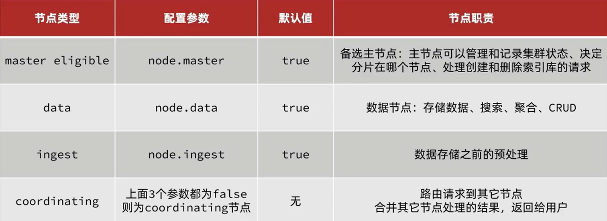

### 集群
- 海量数据存储问题：将索引从逻辑上拆分为N个分片（shard),存储到多个节点。
- 单节点故障问题：将分片数据在不同的节点备份（replica）

**部署**：待补充...
> 管理集群的客户端有很多，可以不启用 Kibana (消耗资源)，
> 例如：cerebro，ElasticHD，Dejavu es-client 等等

```shell
# 设置分片和副本信息
{
    "settings":{
        "number_of_shards":3 //分片数量
        "number_of_replicas":1 //副本数量
    },
    "mappings":{
      "properties":{
        //....
      }
    }
}
```
```shell
# "explatin":true 查看执行计划
GET /axcmsm_test2/_search
{
  "explain": true,
  "query": {
    "match_all": {}
  }
}
```

**脑裂**：

> 默认情况下，一个es就具备上面的所有属性，身兼数职。


**分布式存储**：分片存储
```shell
shard=hash(_routing) & number_of_shards
```
- **_routing**: 默认的文档id
- 算法与分片数量有关，因此索引库一旦创建，分片数量不能修改。

**分布式查询**：
- scatter phase：分散阶段，coordinating node会把请求分发到每一个分片。
- gather phase：聚集节点，coording node汇总data node的搜索结果，并处理结果返回给用户。


**故障转移**
- master 宕机后，EligibleMaster 选举为新的主节点。
- master 节点监控分片，节点状态，将故障节点上的分片转移到正常节点，确保数据安全。
