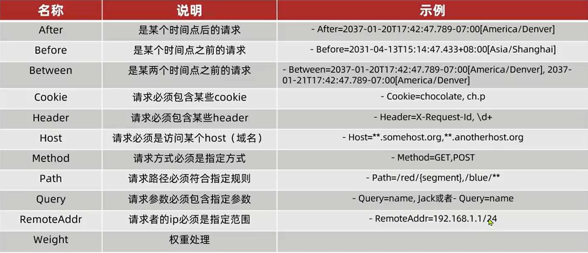
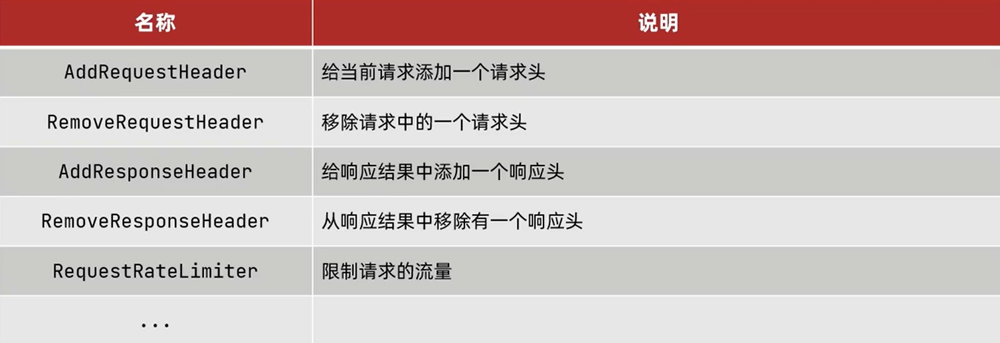

### 服务网关-gateway

**具体功能**：

- 身份验证和权限验证
- 服务路由，负载均衡
- 请求限流

实现方案有俩种：

- zuul：基于Servlet实现，属于堵塞编程，早期的。
- gateway：使用Spring5提供的WebFlux实现，属于响应式编程，具备了更好的编程。

### 入门案例
**导入依赖**
```xml

<dependency>
    <groupId>org.springframework.boot</groupId>
    <artifactId>spring-boot-starter</artifactId>
</dependency>
        <!--        spring cloud-->
<dependency>
<groupId>org.springframework.cloud</groupId>
<artifactId>spring-cloud-dependencies</artifactId>
<version>${spring-cloud.version}</version>
<type>pom</type>
<scope>import</scope>
</dependency>

        <!--        nacos 服务注册发现-->
<dependency>
<groupId>com.alibaba.cloud</groupId>
<artifactId>spring-cloud-starter-alibaba-nacos-discovery</artifactId>
<version>2.2.5.RELEASE</version>
</dependency>
        <!--        gateway依赖-->
<dependency>
<groupId>org.springframework.cloud</groupId>
<artifactId>spring-cloud-starter-gateway</artifactId>
<version>2.2.5.RELEASE</version>
</dependency>
```
**服务配置**：
```yaml
server:
  port: 10010
spring:
  application:
    name: gateway
  cloud:
    nacos: # 服务注册
      server-addr: 192.168.64.101:8848
    gateway:
      routes:
        - id: consumer-service # 路由标示，必须唯一
          uri: lb://consumer-service # 路由目的地
          predicates: # 断言，判断请求是否符合规则
            - Path=/consumer/** # 路劲断言
        - id: producer-service # 路由标示，必须唯一
          uri: lb://producer-service # 路由目的地 也可以http请求地址
          predicates: # 断言，判断请求是否符合规则
            - Path=/producer/** # 路劲断言
```

### 断言工厂
- 路由id：路由的唯一标示
- uri：路由的目的地，支持lb和http俩种方式
- predicates: 路由断言，判断请求是否符合要求，符合则转发路由目的地
- filters: 路由过滤器，处理请求或响应


[全集手册](https://cloud.spring.io/spring-cloud-static/Greenwich.SR1/single/spring-cloud.html#_synchronous_predicates)

[断言配置参考](https://cloud.spring.io/spring-cloud-static/Greenwich.SR1/single/spring-cloud.html#gateway-request-predicates-factories)

>需要什么规则，到官网去找即可。


### 过滤器工厂 
GateWayFilter ：
Spring提供了31种不同路由的过滤器工厂。例如：

[过滤器配置手册](https://cloud.spring.io/spring-cloud-static/Greenwich.SR1/single/spring-cloud.html#_gatewayfilter_factories)
```yaml
如果配置到某个路由下只对某个路由生效，配置到default-filters 对所有路由都生效。
```


### 全局过滤器
GlobalFilter：全局过滤器 与 GateWayFilter 的作用是一样的.
区别在于
- GateWayFilter通过配置定义，逻辑是固定的.
- GlobalFilter 通过代码实现，可以编写自定义逻辑，且拦截所有进入网关的请求
  - 定义方式是实现GlobalFilter接口，重写filter方法
  ```java
   public interface GlobalFilter {
     /**
     *
     * @param exchange 请求上下文，里面获取Request,Response等信息
     * @param chain   用来把请求委托给下一个过滤器链
     * @return    返回标示当前过滤器业务结束
     */
    Mono<Void> filter(ServerWebExchange exchange, GatewayFilterChain chain);
   }
  ```

**具体案例**：拦截请求，判断请求参数是否满足以下条件。
- 参数中是否有authorization,
- authorization参数是否为admin
>同时满足则方向，否则拦截
```java
//@Order(-1)
// 过滤器优先级顺序调整：俩种方式
// 通过@Order注解的方式实现，-1 最早优先级
// 还可以通过实现Ordered，重写getOrder来设置优先级
@Component
public class GlobalFilterConfig implements GlobalFilter, Ordered {

    /**
     *
     * @param exchange 请求上下文，里面获取Request,Response等信息
     * @param chain   用来把请求委托给下一个过滤器链
     * @return    返回标示当前过滤器业务结束
     */
    @Override
    public Mono<Void> filter(ServerWebExchange exchange, GatewayFilterChain chain) {
        //获取请求参数
        ServerHttpRequest request = exchange.getRequest();
        MultiValueMap<String, String> queryParams = request.getQueryParams();

        //获取参数 authorization
        String auth = queryParams.getFirst("authorization");

        //判断参数值是否等于admin
        if ("admin".equals(auth)){
            //放行
            return chain.filter(exchange);
        }
        //拦截
        exchange.getResponse().setStatusCode(HttpStatus.UNAUTHORIZED);//设置状态码，友好提示
        return exchange.getResponse().setComplete(); //进行拦截
    }

    @Override
    public int getOrder() {
        return -1;
    }
}

```

**过滤器执行顺序**：
请求进入路由后，会将当前的 **路由过滤器，DefaultFilter，GlobalFilter** ，合并到一个过滤器链集合中，排序后依次执行每个过滤器。
- GlobalFilter 可以通过Ordered接口，或者@Order注解来指定执行顺序，order值越小，优先级越高。
- 路由过滤器和defaultFilter的order由spring指定，默认是按照声明顺序从1递增。
- 当过滤器的order值一样时，会按照 defaultFilter > 路由过滤器 > GlobalFilter的执行顺序执行。


### 跨域问题
跨域：
- 域名不同
- 域名相同，端口不同，
- 浏览器禁止请求发起者与服务端发送跨域ajax请求，请求被浏览器拦截的问题

解决方式：CORS
```yaml
spring:
  cloud:
    gateway:
      globalcors: # 全局跨域配置
        add-to-simple-url-handler-mapping: true # 解决 options 请求被拦截问题
        cors-configurations:
          '[/**]':
            allowedOrigins: # 允许哪些网站跨域请求
              - "http://localhost:8080"
              - "http://axcmsm.com"
            allowedMethods: # 允许跨域ajax请求方式
              - "GET"
              - "POST"
              - "DELETE"
              - "PUT"
              - "OPTIONS"
            allowedHeaders: "*"  #允许请求携带头信息
            allowCredentials: true # 是否允许携带cookie
            maxAge: 360000 # 跨域检测有效期
```